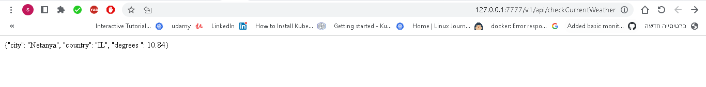
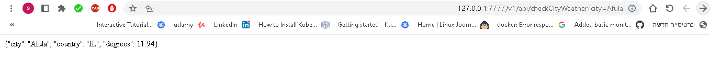
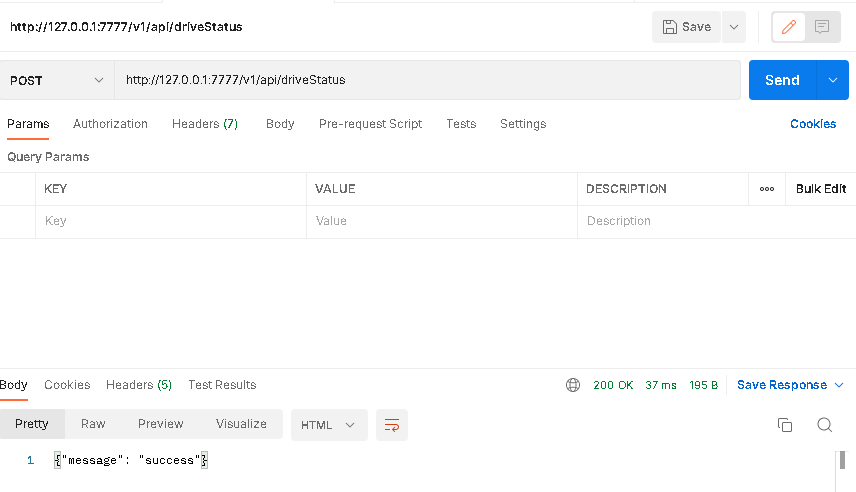
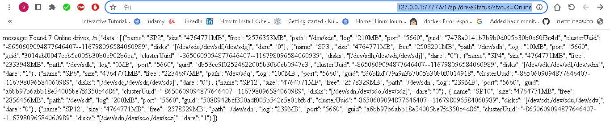
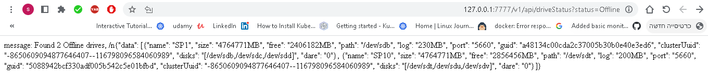
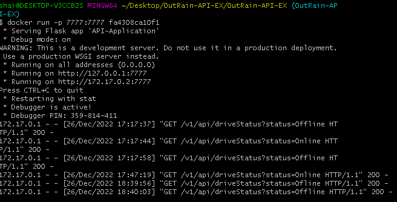
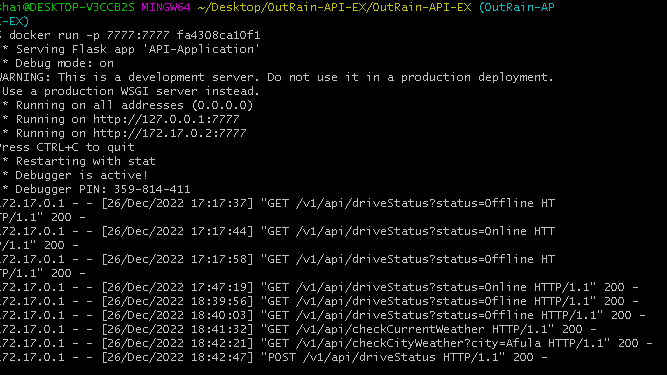

OutRain-API home assignment
Hello, these are the files included in the solution folder
application\API-Application.py dockerfile input.json .dockerignore

1) Please navigate to the OutRain-API-EX folder.
cd OutRain-API-EX
2) Build the application. 
docker build . 

3) Before run the container, please take the IMAGE ID:
docker images

Example:
$ docker images
REPOSITORY   TAG       IMAGE ID       CREATED          SIZE
<none>       <none>    fa4308ca10f1   14 seconds ago   115MB

4) Run the container according the IMAGE ID:
docker run -p 7777:7777 fa4308ca10f1

The service allows you to ask several query and they are:

1) GET  /v1/api/checkCurrentWeather - 127.0.0.1:7777/v1/api/checkCurrentWeather

2) GET  /v1/api/checkCityWeather?city=<city_name> - 127.0.0.1:7777/v1/api/checkCityWeather?city=Afula

3) POST /v1/api/driveStatus

4) GET  /v1/api/driveStatus?status=<drive_status> - 127.0.0.1:7777/v1/api/driveStatus?status=Offline or 127.0.0.1:7777/v1/api/driveStatus?status=Online

Examples: 

